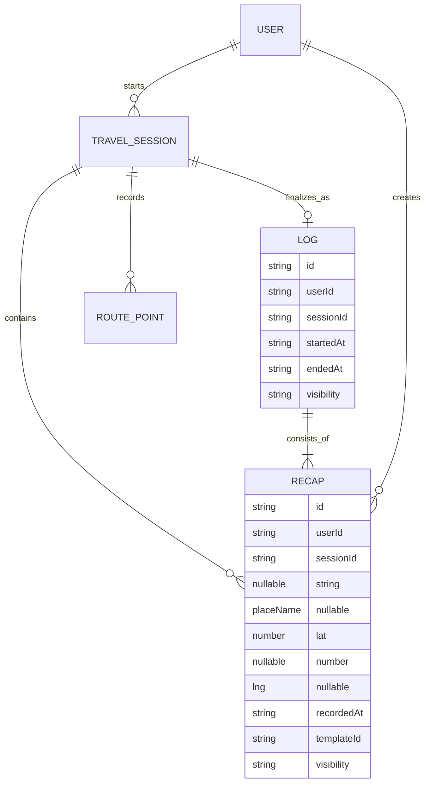
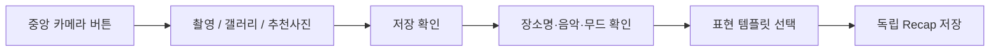
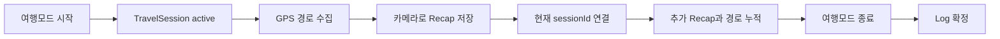

# Soundlog Recap / Log Domain Model

> Status: **Canonical / 반드시 우선 적용**
> Last updated: 2026-07-13
> Scope: Soundlog 모바일 앱, 서버 API, DB, 기획 문서, 화면 문구

이 문서는 Soundlog의 `Recap`과 `Log`를 정의하는 단일 기준 문서다. 다른 문서, 화면, 변수명, API 이름이 이 문서와 충돌하면 이 문서를 우선한다.

## 1. 한 문장 정의

> **리캡은 한 순간의 기록이고, 같은 여행모드에서 만든 리캡들이 모이면 하나의 로그가 된다.**

공식 수식은 다음과 같다.

```text
Recap = 카메라 저장 1회로 생성한 단일 기록
Log = 동일한 TravelSession에 속한 Recap 1개 이상의 시간순 집합
TravelSession = 여행모드 시작부터 종료까지의 기록 컨테이너 + GPS 이동 경로
```

`Recap`을 꾸민 결과물로만 부르거나, `Moment`를 별도 제품 단위로 노출하거나, 여행모드 밖의 리캡을 1개짜리 로그로 부르면 안 된다.

## 2. 핵심 개념

### 2.1 Recap

리캡은 사용자가 카메라 흐름에서 저장한 **한 번의 여행 순간**이다.

예시:

- DDP 앞에서 촬영한 사진 1장
- 사용자가 입력한 장소명 `동대문디자인플라자`
- 촬영 시각
- 내부적으로 저장한 GPS 위치
- 당시 선택한 음악
- 무드
- 촬영 후 선택한 표현 템플릿

리캡은 다음 특징을 가진다.

| 규칙          | 설명                                                                      |
| ------------- | ------------------------------------------------------------------------- |
| 생성 단위     | 카메라 저장 1회당 리캡 1개                                                |
| 생성 위치     | 카메라 촬영/갤러리/추천사진/사진 없이 기록하기 이후의 저장 확인 화면      |
| 템플릿 선택   | 촬영 후 저장 확인 단계에서만 선택                                         |
| 여행모드 연관 | 여행모드 ON이면 현재 여행 세션에 연결, OFF이면 독립 리캡                  |
| 위치          | GPS 좌표는 내부 데이터로 저장하며 화면에 좌표 문자열로 표시하지 않음      |
| 장소명        | 사용자가 직접 입력하는 표시 이름. GPS 좌표나 주소와 다른 값               |
| 공개 범위     | 기본은 `private`; 위치가 있는 경우에만 `public` 전환 가능                 |
| 수정 책임     | 리캡 생성 단계에서 내용을 결정하고, 로그 상세는 이를 읽기 전용으로 보여줌 |

사진, 음악, GPS 위치, 장소명이 일부 없어도 리캡 저장 자체는 가능하다. 다만 위치가 없는 리캡은 공개 지도 핀으로 전환할 수 없다.

### 2.2 Log

로그는 **하나의 여행모드 세션에서 만든 리캡들의 집합**이다.

로그는 사용자가 직접 빈 문서로 만드는 콘텐츠가 아니다. 여행모드를 시작하면 여행 세션이 열리고, 그 세션에서 리캡을 저장할 때 로그의 구성원이 된다. 여행모드를 종료하면 해당 세션의 리캡과 경로가 하나의 로그로 확정된다.

| 규칙           | 설명                                                         |
| -------------- | ------------------------------------------------------------ |
| 식별 기준      | `TravelSession.id` 또는 그와 1:1 대응하는 `sessionId`        |
| 구성원         | 같은 `sessionId`를 가진 리캡만 포함                          |
| 정렬           | 촬영 시각 오름차순                                           |
| 최소 구성      | 리캡 1개 이상. 여행 중 리캡이 1개뿐이어도 로그               |
| 빈 여행        | 리캡이 0개인 여행 세션은 로그 탭에 노출하지 않음             |
| 독립 리캡      | 여행모드 밖에서 만든 리캡은 로그에 포함하지 않음             |
| 자동 병합 금지 | 장소, 날짜, 거리, 음악이 같아도 다른 여행 세션은 합치지 않음 |
| 종료 후 표현   | 로그 상세는 읽기 전용 회고 화면이며 템플릿 편집기가 아님     |

따라서 아래 표현은 틀리다.

```text
잘못된 표현: 여행모드 밖의 리캡은 1개짜리 로그다.
올바른 표현: 여행모드 밖의 리캡은 독립 리캡이며 어떤 로그에도 속하지 않는다.
```

### 2.3 TravelSession

여행 세션은 로그를 만드는 실행 컨텍스트다.

```text
idle -> 여행모드 시작 -> active -> 여행모드 종료 -> ended
```

여행 세션이 담당하는 데이터:

- 시작 시각과 종료 시각
- 여행 상태와 무드
- 세션 중 생성한 리캡 ID 목록
- 세션 중 수집한 GPS 경로점 `routePoints`
- 서버 동기화 상태
- 최종 로그 ID

여행 세션과 로그는 개념상 구분한다.

- 여행 세션: 이동 중인 상태와 수집 과정
- 로그: 여행 종료 후 다시 보는 결과

### 2.4 RoutePoint

경로점은 여행모드 중 수집한 GPS 샘플이다. IP 주소로 위치를 계산하지 않는다.

```ts
type RoutePoint = {
  lat: number;
  lng: number;
  recordedAt: string;
  accuracyMeters?: number;
};
```

경로점은 리캡이 아니다. 사용자가 카메라를 누르지 않아도 여행모드가 활성화되어 있으면 이동 경로를 만들기 위해 수집될 수 있다.

현재 MVP 구현은 앱이 foreground에 있는 동안 GPS 경로를 기록한다. background 위치 추적은 권한, 배터리, 스토어 심사 정책을 별도로 확정한 뒤 추가한다.

## 3. 관계와 불변 규칙



반드시 지켜야 하는 불변 규칙:

1. 리캡 하나는 최대 하나의 여행 세션에만 속한다.
2. `sessionId`가 없는 리캡은 독립 리캡이며 로그 구성원이 아니다.
3. `sessionId`가 있는 리캡은 해당 세션의 로그 구성원이다.
4. 로그 하나는 정확히 하나의 여행 세션과 대응한다.
5. 서로 다른 `sessionId`의 리캡을 장소나 날짜가 가깝다는 이유로 합치지 않는다.
6. 여행 세션에 리캡이 1개만 있어도 유효한 로그다.
7. 여행 세션에 리캡이 0개면 로그 탭에 표시할 로그를 생성하지 않는다.
8. 로그의 리캡 개수는 현재 남아 있는 구성원 수와 항상 일치해야 한다.
9. 로그 지도는 그 로그에 속한 리캡 위치만 핀으로 표시한다.
10. 로그 경로선은 그 로그의 여행 세션에서 수집한 경로점만 연결한다.
11. 다른 여행 로그, 주변 공개 리캡, 관광지 추천 핀은 로그 상세 지도에 섞지 않는다.
12. 로그 상세에서 리캡 템플릿을 수정하지 않는다.

## 4. 생성 흐름

### 4.1 여행모드 밖에서 리캡 생성



결과:

- 리캡은 생성된다.
- `sessionId`는 없다.
- 로그는 생성되지 않는다.
- 로그 탭에는 나타나지 않는다.
- 공개 설정 시 메인 지도의 리캡 핀으로는 나타날 수 있다.

### 4.2 여행모드에서 리캡 생성



결과:

- 세션에서 만든 모든 리캡은 같은 `sessionId`를 가진다.
- 각 리캡은 독립적인 사진, 장소, 음악, 시각, 템플릿을 유지한다.
- 로그는 리캡을 복제하지 않고 구성원 관계로 묶는다.
- GPS 경로는 세션 단위로 저장한다.

## 5. 로그 탭과 로그 상세

### 5.1 로그 탭

로그 탭은 여행 로그를 탐색하는 화면이다. 독립 리캡 보관함이 아니다.

로그 카드 표시 조건:

```text
sessionId가 있고 + 해당 세션의 리캡이 1개 이상인 경우
```

카드 정보:

- 로그 대표 이미지
- 대표 장소명
- 리캡 개수
- 여행 날짜 또는 시작 시각
- 공개/비공개 상태

`다른사람 보기`는 다른 사용자가 공개한 여행 로그만 보여준다. `모든 사람 보기`는 내가 볼 권한이 있는 여행 로그를 합쳐 보여준다. 어떤 탭에서도 여행모드 밖의 독립 리캡을 로그 카드로 위장해서 보여주면 안 된다.

### 5.2 로그 상세

로그 상세의 목적은 편집이 아니라 여행 회고다.

표시 순서:

1. 로그 제목, 여행 날짜, 공개 범위
2. 시간순 사운드로그: 로그에 속한 리캡을 한 장씩 감상
3. GPS 여행 로드맵
4. 이동 시간, 이동 거리, 방문 장소 요약
5. 사용한 음악 요약
6. 고정 `SOUNDLOG` 카드 형식의 공유용 결과
7. 이미지 저장과 OS 공유

로그 상세에서 제거해야 하는 기능:

- 표현 템플릿 변경
- 음악 스티커 위치 편집
- 시간/문구 드래그 편집
- 새 리캡 만들기 CTA
- 주변 사람 또는 주변 관광지 핀

템플릿과 꾸미기 값은 리캡 생성 단계에서 확정하고, 로그 상세에서는 저장된 결과를 읽기 전용으로 렌더링한다.

`공유용 리캡`은 리캡에 저장된 `album`, `LP`, `film`, `map` 템플릿과 무관하게 항상 기존 `SOUNDLOG` 카드 형식으로 만든다. 여행 로그에서는 가장 최근 리캡을 대표 카드로 사용하고, 독립 리캡에서는 해당 리캡 자체를 사용한다.

## 6. 로그 지도 규칙

로그 지도는 메인 지도와 데이터 목적이 다르다.

| 지도           | 목적                                             | 허용 핀                      |
| -------------- | ------------------------------------------------ | ---------------------------- |
| 메인 지도      | 주변 공개 리캡 발견, 내 리캡 탐색, 여행모드 시작 | 필터에 맞는 주변/내 리캡 핀  |
| 로그 상세 지도 | 특정 여행을 시간과 공간으로 회고                 | **현재 로그 구성 리캡 핀만** |

메인 지도의 `전체 리캡`과 `내 리캡`은 현재 줌 레벨에서 시각적으로 겹치는 가까운 좌표를 숫자 원형 클러스터로 묶는다. 축소할수록 더 넓은 범위를 묶고 확대할수록 개별 핀으로 분리하며, 클러스터 선택 시 포함된 리캡 목록과 각 리캡의 읽기 전용 상세 진입점을 제공한다. 이 클러스터는 지도 표시 방식일 뿐 서로 다른 리캡이나 로그의 소유 관계를 병합하지 않는다.

로그 지도 렌더링 규칙:

1. 로그의 `routePoints`가 2개 이상이면 시간순으로 선을 연결한다.
2. 로그에 속한 리캡 중 GPS 위치가 있는 리캡만 번호 핀으로 표시한다.
3. 번호는 리캡 촬영 시각 오름차순으로 `1, 2, 3...`을 부여한다.
4. 핀을 누르면 해당 리캡의 사진, 장소명, 음악, 시각을 미리보기로 보여준다.
5. 미리보기의 상세 액션은 해당 리캡 감상 화면으로 이동한다.
6. 다른 로그의 리캡, 주변 공개 리캡, 현재 관광지, 추천 장소는 표시하지 않는다.
7. 경로 데이터가 없고 리캡 위치만 있으면 리캡 위치를 시간순으로 연결한 보조 경로를 사용한다.
8. 경로와 리캡 위치가 모두 없으면 빈 지도를 억지로 만들지 않고 위치 기록 없음 상태를 보여준다.
9. 좌표 숫자를 장소명 대신 사용자에게 노출하지 않는다.

예시:

```text
서울 여행 Log A
  Recap 1: 광화문, 10:12, GPS 있음  -> 지도 핀 1
  Recap 2: 익선동, 13:40, GPS 있음  -> 지도 핀 2
  Recap 3: 장소명만 입력, GPS 없음   -> 사운드로그에는 표시, 지도 핀 없음

부산 여행 Log B
  Recap 4: 광안리, 20:05, GPS 있음  -> Log A 지도에는 절대 표시하지 않음
```

## 7. 위치, 장소명, 주소의 구분

세 값은 서로 대체하지 않는다.

| 값       | 입력 주체                | 용도                     | 사용자 노출              |
| -------- | ------------------------ | ------------------------ | ------------------------ |
| GPS 위치 | 기기 위치 센서           | 지도 핀, 경로, 거리 계산 | 좌표 숫자는 숨김         |
| 장소명   | 사용자                   | 기억을 위한 이름         | 리캡/로그에 표시         |
| 주소     | 역지오코딩 또는 관광 API | 검색과 위치 설명         | 주소 UI가 있을 때만 표시 |

금지 사례:

```text
장소명 = "현재 위치 37.786, -122.406"
장소명 = IP 주소
주소 필드에 사용자 장소 별칭 저장
```

장소명이 비어 있으면 `장소 미입력`처럼 명시적인 빈 상태를 사용한다. GPS 좌표를 문자열로 변환해 채우지 않는다.

## 8. 공개 범위와 개인정보

기본 원칙은 모든 기록을 private로 저장하고 사용자가 명시적으로 public으로 바꾸는 것이다.

소유자 로그 상세:

- 로그의 모든 리캡을 볼 수 있다.
- 저장된 전체 GPS 경로를 볼 수 있다.
- private/public 리캡 핀을 모두 볼 수 있다.

다른 사용자 로그 상세:

- 공개된 로그와 공개 허용된 리캡만 볼 수 있다.
- 정확한 전체 이동 경로 `routePoints`는 제공하지 않는다.
- 서버가 허용한 공개 리캡 위치만 핀으로 표시한다.
- 비공개 리캡의 존재, 위치, 음악, 사진을 추론할 수 있는 개수 정보도 노출하지 않는다.

서버는 로그 상세 응답을 만들 때 요청자가 소유자인지 확인하고 경로 데이터를 제한해야 한다. 클라이언트에서 숨기는 것만으로 개인정보 보호를 구현하면 안 된다.

## 9. 삭제와 수정 규칙

### 리캡 삭제

- 리캡을 삭제하면 소속 로그에서도 즉시 제외한다.
- 삭제 후 로그의 리캡이 1개 남아도 로그는 유지한다.
- 마지막 리캡을 삭제해 0개가 되면 해당 로그는 로그 탭에서 숨긴다.
- 여행 세션 경로 데이터의 보존/삭제는 계정 데이터 정책에 따른다.

### 리캡 수정

- 장소명, 음악 등 리캡 자체 데이터 수정은 해당 리캡에만 반영한다.
- 수정된 리캡이 로그의 대표 리캡이면 로그 카드의 대표 정보도 다시 계산한다.
- 다른 여행 로그의 대표 정보에는 영향을 주지 않는다.

### 로그 수정

- 로그 제목과 공개 범위 같은 로그 메타데이터만 수정할 수 있다.
- 로그 상세에서 개별 리캡의 표현 템플릿을 다시 고르지 않는다.
- 세션이 다른 리캡을 임의로 옮기거나 합치는 기능은 별도 기획 없이는 제공하지 않는다.

## 10. 오프라인과 동기화

리캡은 네트워크가 없어도 로컬에 먼저 저장한다.

```text
local/pending -> synced
             -> failed -> retry -> synced
```

동기화 규칙:

1. 로컬 리캡 ID를 idempotency key로 사용해 중복 생성을 막는다.
2. 여행모드 리캡의 `sessionId`를 재시도 과정에서도 잃지 않는다.
3. 표현 템플릿과 공개 범위도 재시도 payload에 보존한다.
4. 여행 종료 시 pending 리캡을 먼저 동기화하고 로그 생성을 시도한다.
5. 일부 리캡 동기화가 실패하면 로컬 로그를 우선 보여주며 구성원을 버리지 않는다.
6. 앱 재실행 후에도 활성 여행 세션과 GPS 경로를 복구한다.
7. 여행 종료 로그 생성 요청도 별도 영속 큐에 저장하고, 리캡 업로드가 모두 끝난 뒤 자동 재시도한다.
8. 오프라인 로컬 세션은 서버가 소유 리캡을 확인한 뒤 종료 세션으로 복구하므로 로컬 `sessionId`를 바꾸거나 버리지 않는다.

## 11. 제품 용어와 레거시 코드 매핑

현재 코드와 서버에는 과거 기획에서 유래한 이름이 남아 있다. 새 기능은 아래 의미를 기준으로 이해해야 한다.

| 제품 용어     | 현재 코드/서버 이름                                        | 실제 의미                              |
| ------------- | ---------------------------------------------------------- | -------------------------------------- |
| Recap         | `MomentLog`, `RecapShareMoment`, `/v1/recap-captures`      | 카메라 저장 1회로 만든 단일 리캡 원본  |
| Log           | 서버 `Recap`, `RecapShare`, `MomentLogGroup`, `/v1/recaps` | 여행 세션의 리캡 집합과 공유/회고 결과 |
| TravelSession | `TravelSession`, `sessionId`                               | 로그의 소속 경계와 여행 상태           |
| GPS 경로      | `RoutePoint[]`, `routePoints`                              | 여행모드 중 기록한 이동 경로           |

중요:

- 코드의 `MomentLog`를 사용자에게 `Moment` 또는 `모먼트 로그`로 노출하지 않는다.
- 서버의 `Recap` 모델이 제품의 여행 `Log` 역할도 하고 있다는 점을 인지한다.
- 대규모 이름 변경은 Prisma 마이그레이션, API 호환성, 앱 로컬 저장소 마이그레이션을 포함한 별도 작업으로 진행한다.
- 이름이 레거시라고 해서 제품 규칙을 레거시 의미로 구현하지 않는다.

## 12. 권장 데이터 계약

제품 의미를 명시한 논리 모델은 다음과 같다.

```ts
type Recap = {
  id: string;
  userId: string;
  sessionId?: string;
  photoUrl?: string;
  location?: { lat: number; lng: number };
  placeName?: string;
  recordedAt: string;
  track?: Track;
  moodTags: MoodTag[];
  note?: string;
  templateId: "album" | "lp" | "film" | "map";
  visibility: "private" | "public";
};

type TravelLog = {
  id: string;
  userId: string;
  sessionId: string;
  recapIds: string[];
  routePoints: RoutePoint[];
  startedAt: string;
  endedAt: string;
  title?: string;
  visibility: "private" | "public";
};
```

구현에서 집계 필드 `recapCount`, 대표 이미지, 대표 장소, 대표 음악을 저장할 수 있지만, 원본 리캡 목록과 불일치하지 않도록 서버에서 갱신해야 한다.

## 13. 화면 문구 규칙

사용자에게 사용하는 용어:

| 상황         | 권장 문구                                      |
| ------------ | ---------------------------------------------- |
| 카메라 저장  | `리캡 저장하기` 또는 `이 순간 리캡으로 남기기` |
| 여행 중 누적 | `이번 여행에 리캡이 3개 쌓였어요`              |
| 여행 종료    | `여행 로그가 완성됐어요`                       |
| 로그 카드    | `3개 리캡 · 서울 여행`                         |
| 로그 상세    | `여행 사운드로그`, `GPS 여행 경로`             |
| 위치 없음    | `위치 기록 없음`                               |
| 장소 없음    | `장소 미입력`                                  |

사용자 화면에서 피해야 하는 용어:

- Moment
- MomentLog
- 모먼트 로그
- 좌표를 포함한 `현재 위치 37.123, 127.123`
- 여행모드 밖 리캡을 가리키는 `1개짜리 로그`

## 14. 구현 체크리스트

리캡/로그 관련 작업은 아래 항목을 모두 확인한다.

### 생성

- [ ] 카메라 저장 1회가 리캡 1개를 만드는가?
- [ ] 여행모드 ON이면 현재 `sessionId`가 저장되는가?
- [ ] 여행모드 OFF이면 `sessionId` 없이 독립 리캡이 되는가?
- [ ] 템플릿 선택이 촬영 후 저장 확인 화면에만 있는가?

### 목록

- [ ] 로그 탭이 `sessionId`가 있는 여행 로그만 보여주는가?
- [ ] 리캡 1개짜리 여행 세션도 로그로 보여주는가?
- [ ] 독립 리캡을 로그 카드로 보여주지 않는가?
- [ ] 공유용 리캡이 템플릿과 무관하게 고정 `SOUNDLOG` 카드로 보이는가?

### 상세 지도

- [ ] 현재 로그의 리캡만 번호 핀으로 보여주는가?
- [ ] 다른 로그와 주변 공개 핀이 섞이지 않는가?
- [ ] 현재 로그의 `routePoints`만 경로선으로 연결하는가?
- [ ] 경로가 없을 때 리캡 위치 fallback 또는 빈 상태가 동작하는가?
- [ ] 좌표 숫자를 장소명으로 표시하지 않는가?
- [ ] 같은 위치의 리캡이 묶음 핀으로 표시되고, 핀 선택 시 미리보기 목록과 읽기 전용 상세를 열 수 있는가?

### 개인정보

- [ ] 소유자가 아닌 사용자에게 전체 경로를 서버가 반환하지 않는가?
- [ ] private 리캡의 위치와 존재가 공개 응답에 섞이지 않는가?
- [ ] public 전환 전에 위치 존재 여부를 검증하는가?

### 동기화

- [ ] 오프라인 재시도에서 `sessionId`, `templateId`, 공개 범위를 보존하는가?
- [ ] 여행 종료 시 리캡과 경로를 잃지 않는가?
- [ ] 중복 요청이 중복 리캡/로그를 만들지 않는가?
- [ ] 앱 재실행 후 남은 여행 종료 로그 생성 큐가 자동 재시도되는가?

## 15. 대표 수용 시나리오

### 시나리오 A: 여행 중 리캡 3개

1. 사용자가 여행모드를 시작한다.
2. GPS 경로 수집이 시작된다.
3. 광화문, 익선동, 남산에서 리캡을 각각 저장한다.
4. 세 리캡은 같은 `sessionId`를 가진다.
5. 여행모드를 종료한다.
6. 로그 탭에 리캡 3개짜리 여행 로그가 하나 나타난다.
7. 상세 지도에는 세 리캡 핀과 해당 세션의 이동 경로만 보인다.

### 시나리오 B: 여행 중 리캡 1개

1. 사용자가 여행모드를 시작한다.
2. 리캡 하나를 저장하고 여행을 종료한다.
3. 리캡 개수가 하나여도 로그 탭에 여행 로그 하나가 나타난다.

### 시나리오 C: 여행모드 밖 리캡

1. 여행모드를 시작하지 않고 중앙 카메라 버튼을 누른다.
2. 리캡을 저장한다.
3. 리캡은 독립 리캡으로 저장된다.
4. 로그 탭에는 나타나지 않는다.
5. 공개한 경우 메인 지도의 공개 리캡 핀으로는 나타날 수 있다.

### 시나리오 D: 다른 여행 두 번

1. 오전 서울 여행에서 리캡 2개를 저장하고 종료한다.
2. 오후 새 여행모드를 시작해 같은 장소에서 리캡 1개를 저장한다.
3. 장소와 날짜가 같아도 `sessionId`가 다르므로 로그는 두 개다.
4. 각 로그 상세 지도에는 자기 세션의 리캡과 경로만 보인다.

## 16. 변경 결정 기록

2026-07-13부터 Soundlog의 제품 용어는 다음으로 확정한다.

```text
과거: Moment가 모여 Log가 되고, Recap은 Log를 꾸민 결과물
현재: Recap이 모여 Log가 되며, Log는 여행모드에서 만든 Recap의 집합
```

과거 API/DB 이름은 호환성을 위해 당분간 유지할 수 있지만, 모든 신규 기획과 UI는 현재 정의를 따라야 한다.

## 17. 현재 구현 기준점

다른 작업 세션은 아래 파일에서 현재 구현을 확인한다.

| 책임                                 | 프론트엔드 기준 파일                                        |
| ------------------------------------ | ----------------------------------------------------------- |
| 카메라 촬영과 Recap 로컬 저장        | `src/components/moment-capture/MomentCaptureScreen.tsx`     |
| 촬영 후 템플릿/장소/공개 범위 설정   | `src/components/moment-capture/MomentReviewPanel.tsx`       |
| Recap 오프라인 큐와 동기화           | `src/store/momentLogStore.ts`, `src/utils/momentLogSync.ts` |
| 여행 종료 Log 생성 영속 큐           | `src/store/travelLogSyncStore.ts`, `src/utils/travelLogSync.ts` |
| 여행 세션과 경로 로컬 영속화         | `src/store/travelSessionStore.ts`                           |
| foreground GPS 경로 수집             | `src/hooks/useTravelRouteTracking.ts`                       |
| `sessionId` 기반 Log 그룹 생성       | `src/utils/recapMappers.ts`                                 |
| 여행 Log만 보여주는 격자 목록        | `src/components/recap/RecapListScreen.tsx`                  |
| Log 상세과 독립 Recap 상세 분기      | `src/components/recap-share/RecapShareScreen.tsx`           |
| 현재 Log Recap 핀과 세션 경로 렌더링 | `src/components/recap-share/RecapRouteMap.tsx`              |

서버 기준점:

| 책임                         | 서버 기준 파일                                     |
| ---------------------------- | -------------------------------------------------- |
| Recap 원본과 Log 집계 서비스 | `SoundLogServer/src/services/soundlog.service.ts`  |
| Prisma Recap/Log 레거시 모델 | `SoundLogServer/prisma/models/recap.prisma`        |
| 여행 세션 모델               | `SoundLogServer/prisma/models/travel.prisma`       |
| 서버 전용 도메인 계약        | `SoundLogServer/docs/recap-log-domain-contract.md` |

경로 추적의 현재 보장 범위는 foreground다. background 추적을 구현하기 전에는 문서, QA, 사용자 문구에서 앱을 종료해도 계속 기록된다고 약속하면 안 된다.
